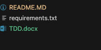

# Generate Technical Design Doc for a Oracle VBCS Applictaion

Generate TDD for a Oracle VBCS project in a minute.

I am implementing a python based program to create technical design doc of a VBCS applictaion.

feel free to fork and create pull requests!

## Note: Updating all description properties in VBCS objects is essential for proper documentation. 

## Authors

- [MOHD AHSHAN DANISH](https://www.github.com/mailtodanish)

```
Download in D: Drive  [WINDOW]
```

1. Create virtual Env

```
python3 -m venv .venv
```
2. Activate virtual env

```
source .venv/bin/activate [LINUX]
venv\Scripts\activate   [WINDOW]
```
3. Install required packages

```
python -m pip install -r requirements.txt
```
4. Delete the existing demo project and upload your project in project directory

5. Run

``` 
python main.py
```

If you face any issue please raise a issue request under issue.

Technical Design Doc will be generated in main folder. [TDD.docx]


## Sample Document:




